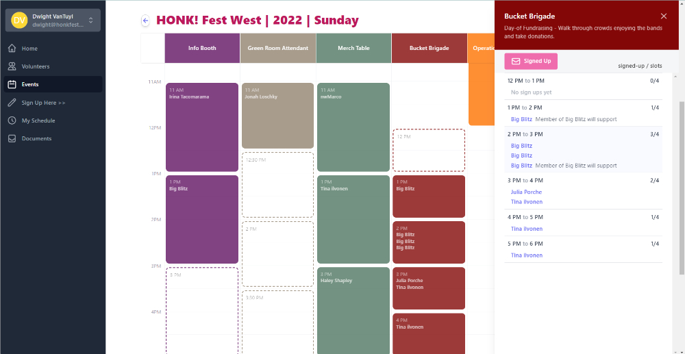

# Volunteer System

A volunteer system for authoring and publishing Events, Jobs, and Shifts.



## Stack

- [Svelte](https://svelte.dev/): UI Framework
- [svelte-spa-router](https://github.com/ItalyPaleAle/svelte-spa-router): UI Router
- [XState](https://xstate.js.org/): UI State Manager
- [tailwindcss](https://tailwindcss.com/): CSS Framework
- [Firebase](https://firebase.google.com/): Authentication & Datastore
- [Netlify](https://www.netlify.com/): Webhost

## Setup

### Install Dependancies

- nodejs lte
- java

### Install Dependancies with asdf

asdf is a tool version manager used to install versions of nodejs and java required by this application.

1. Follow instructions on asdf's [getting started](https://asdf-vm.com/guide/getting-started.html)
2. Run the asdf install instruction from the root directory of this project

```
asdf install
```

### Install the Local Emulator Suite

Before installing the Emulator Suite you will need:

- Node.js version 8.0 or higher.
- Java JDK version 11 or higher.

To install the Emulator Suite:

1. Install the Firebase CLI. If you don't already have the Firebase CLI installed, install it now. You will need CLI version 8.14.0 or higher to use the Emulator Suite. You can check which version you have installed using the following command:

```
firebase --version
```

or

```
npm install -g firebase-tools
firebase login
```

2. If you haven't already done so, initialize the current working directory as a Firebase project, following the onscreen prompts and select **Emulators: Set up local emulators for Firebase products**:

```
firebase init
```

3. Select **Firestore Emulator** and **Authentication Emulator**

### Set Environment Variables

1. Copy the `.env-template` to an new `.env` file.
2. Look up current environment variables from the Netlify volunteer-system dashboard.

## Running

1. Start up the firebase emulator for authentication and firestore:

```
npm run emulators
```

2. Start up the Svelte Dev server

Default hosting setup for [Netlify](https://netlify.com/).
